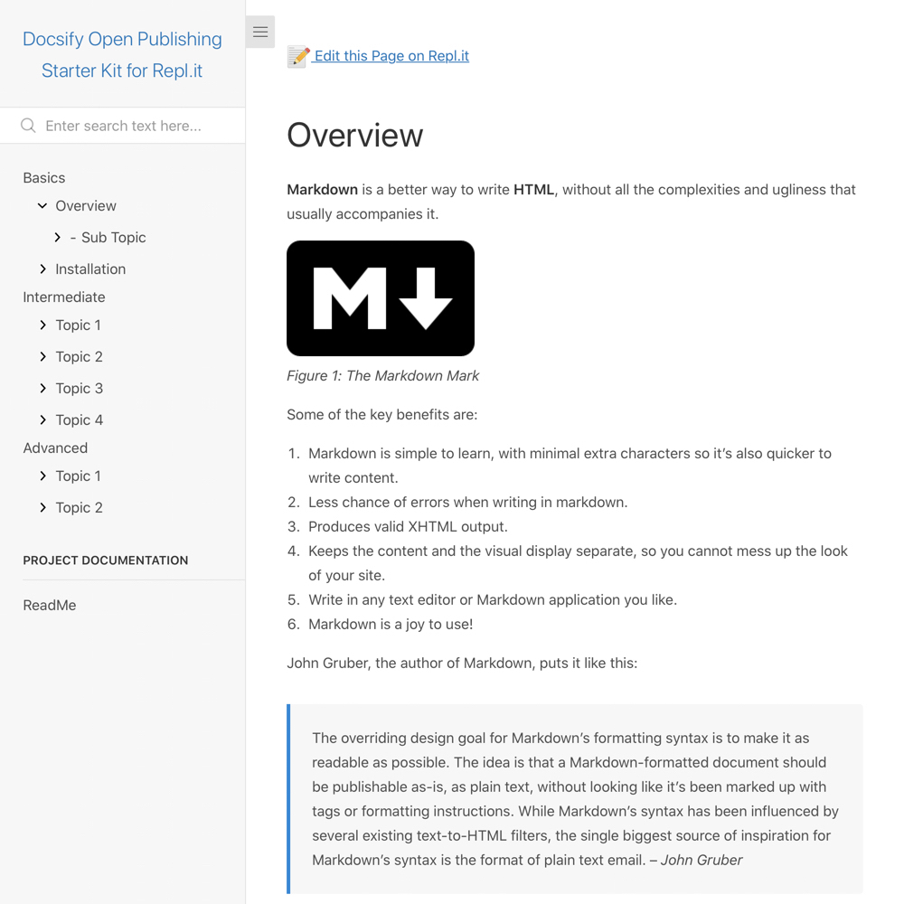

# Docsify Open Publishing Starter Kit for Repl.it

> This is a starter kit to create an open [Docsify](https://docsify.js.org) documentation site on [Repl.it](https://repl.it/), with a link automatically created on each page to edit the source Markdown text on Repl.it.

📸 Docsify Open Publishing for Repl.it Screenshot
---

_Figure 1. Docsify Open Publishing Starter Kit for Repl.it. Explore a demo at [docsify-open-publishing-starter-kit-for-replit--hibbittsdesign.repl.co/#/](https://docsify-open-publishing-starter-kit-for-replit--hibbittsdesign.repl.co/#/)_

🚀 Quick Repl.it Install Instructions
---
**Pre-flight Checklist**  

1. [Repl.it account](https://repl.it/signup)

**Installation Steps**  

1. Copy the Git address of this GitHub repository (https://github.com/hibbitts-design/docsify-open-publishing-starter-kit-for-replit.git)
2. Create a new Repl.it Project, select the **Import from GitHub** Tab , and paste the Git address previously copied to your clipboard
3. Choose "HTML, CSS, JS" (which should be shown by default) and tap **done**
4. And you're ready to go! (view your new site using the the **Run** button)

📝 "Edit the Page on Repl.it" Link Setup
---

1. Edit the file `index.html` in your Repl.it files
2. Find the sample Repl.it project URL `'https://repl.it/@hibbittsdesign/docsify-open-publishing-starter-kit-for-replit'` and replace it with your own Repl.it project URL, for example `'https://repl.it/@yourusername/your-replit-project-name'`
3. Save your changes.

📚 Learn More about Docsify
---
[Docsify Documentation](https://docsify.js.org/#/?id=docsifyg)

🙇‍Credits and Special Thanks
---
[Docsify Themeable](https://github.com/jhildenbiddle/docsify-themeable)  
[Repl.it](https://https://repl.it/)  
